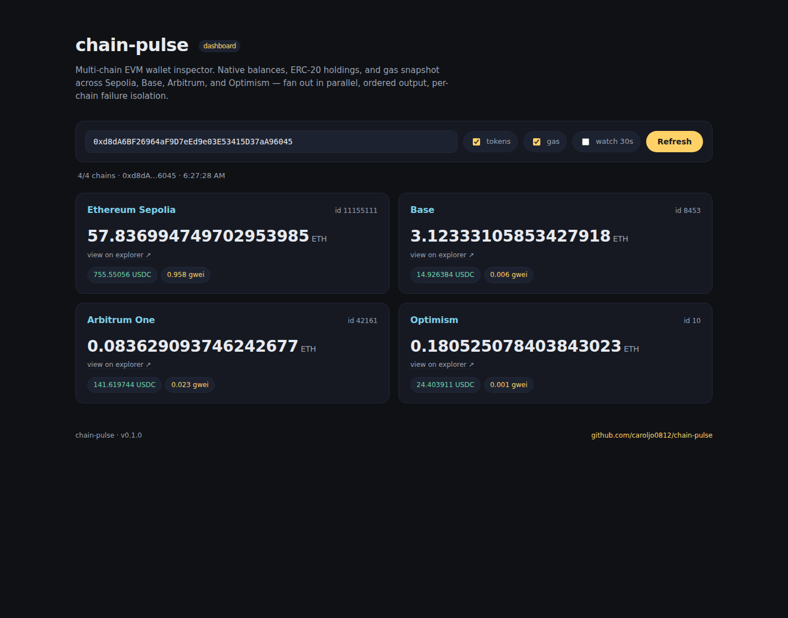

# chain-pulse

Quick multi-chain EVM wallet inspector. Point it at an address, get native balances, USDC balances, and current gas prices across Sepolia, Base, Arbitrum, and Optimism in one shot.

Built this because flipping between four block explorers to track testnet wallets got old.

Status: early. Works on my machine.



## Install

```bash
git clone https://github.com/caroljo0812/chain-pulse.git
cd chain-pulse
python -m venv .venv && source .venv/bin/activate
pip install -e .
```

## Quick start

```bash
# Single address, all default chains
chain-pulse 0xd8dA6BF26964aF9D7eEd9e03E53415D37aA96045

# Specific chains only
chain-pulse 0xd8dA... --chains sepolia,base

# Include curated ERC-20 balances (USDC per chain)
chain-pulse 0xd8dA... --tokens

# Add current gas prices
chain-pulse 0xd8dA... --gas

# Live polling mode, refresh every 10s
chain-pulse 0xd8dA... --watch 10

# Batch mode from file (one address per line, # comments allowed)
chain-pulse --file wallets.txt

# JSON output for piping
chain-pulse 0xd8dA... --tokens --gas --json | jq '.chains[] | select(.ok)'
```

## Dashboard

There's also a small web dashboard with the same data, useful for keeping an eye on a wallet without re-running the CLI:

```bash
chain-pulse-serve --host 127.0.0.1 --port 8765
# open http://127.0.0.1:8765
```

The dashboard is a single page with a stateless FastAPI backend. Endpoints:

- `GET /` — the page
- `GET /api/scan?address=0x...&tokens=true&gas=true` — scan one address
- `GET /api/chains` — list configured chains
- `GET /api/health` — version + status

## Configuration

Override default RPC endpoints with a `.env` file (see `.env.example`):

```
SEPOLIA_RPC=https://ethereum-sepolia-rpc.publicnode.com
BASE_RPC=https://base-rpc.publicnode.com
ARBITRUM_RPC=https://arbitrum-one-rpc.publicnode.com
OPTIMISM_RPC=https://optimism-rpc.publicnode.com
```

Public RPCs work out of the box. Bring your own Alchemy/Infura keys for heavier usage — the public ones rate-limit if you hammer them.

## What it does

- Native balance per chain via `eth_getBalance`
- ERC-20 balances via `balanceOf` (curated list, USDC per chain by default)
- Gas price snapshot (gwei) via `eth_gasPrice`
- Parallel fan-out across chains, ordered output, per-chain failure isolation
- Decimal math throughout (no float precision drops on dust or large balances)

## Tests

```bash
pip install -e ".[dev]"
pytest -q
ruff check .
```

## License

MIT
